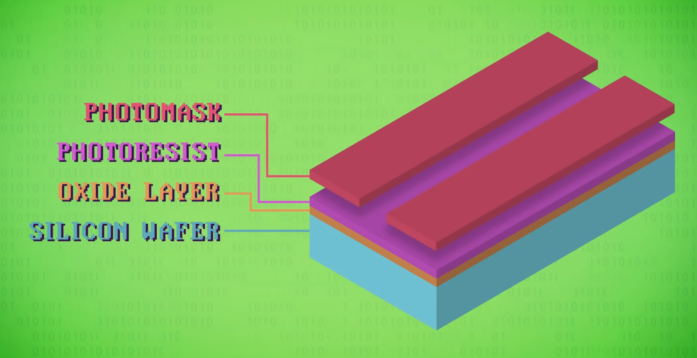
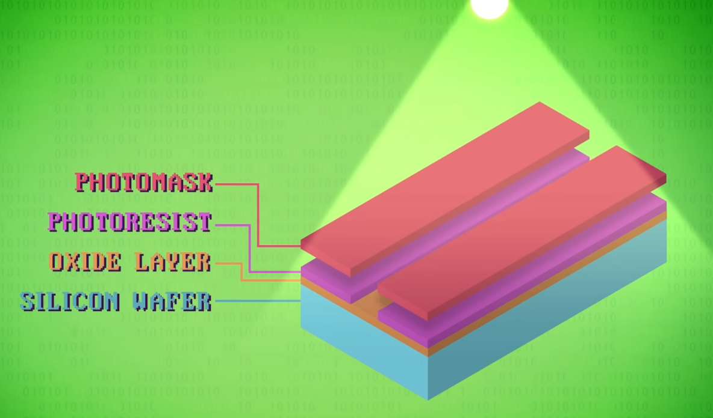
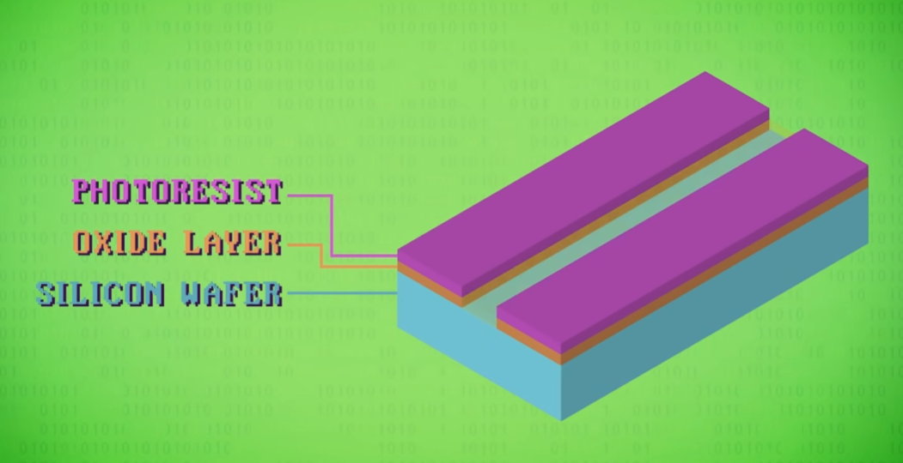
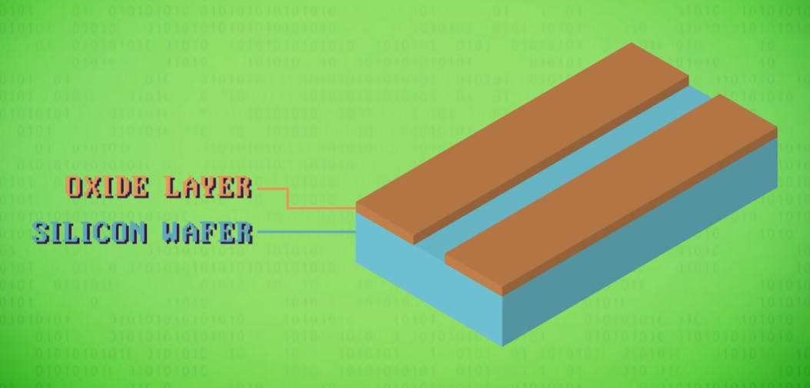
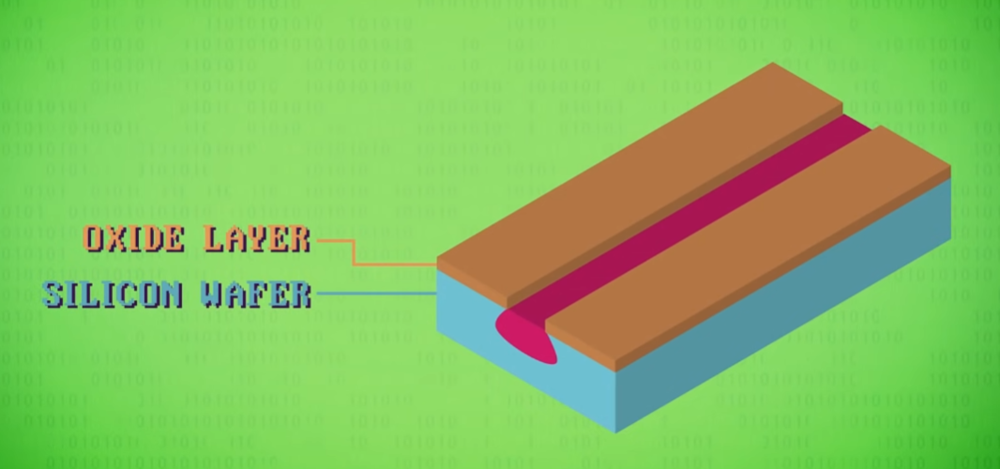
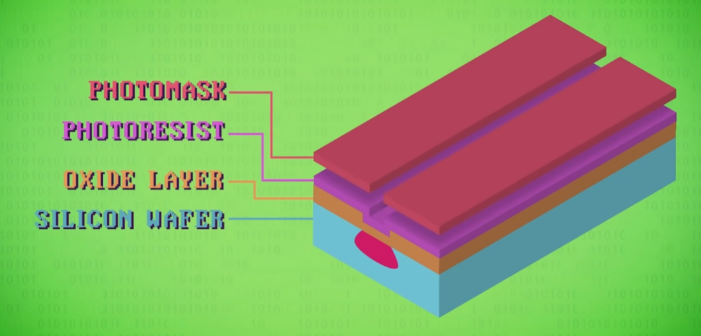
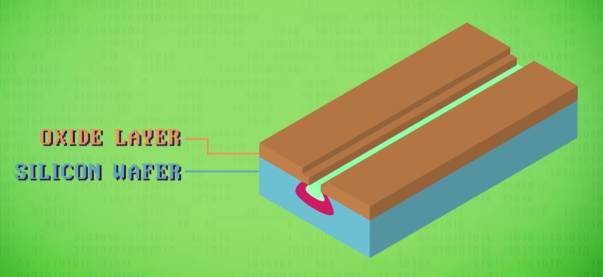
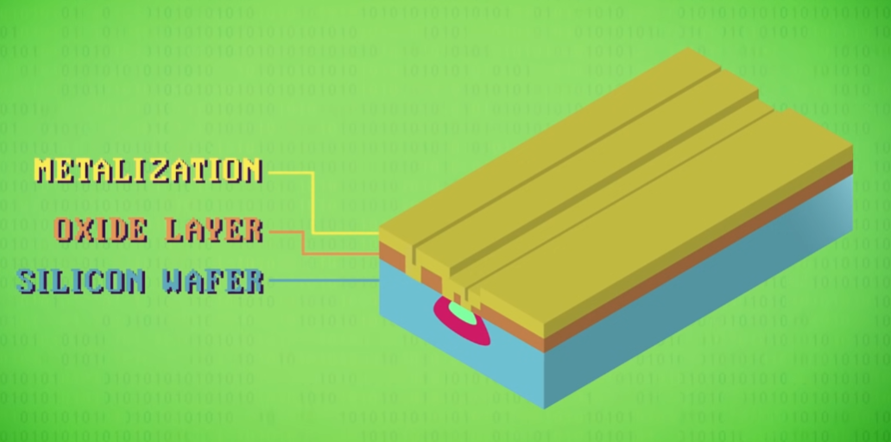
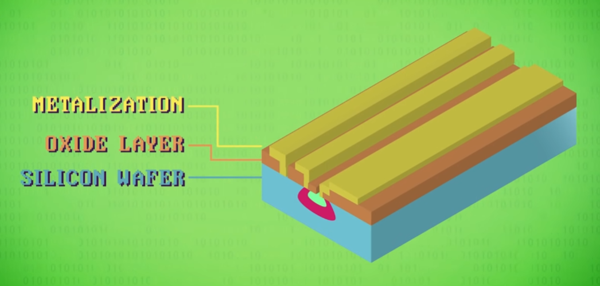
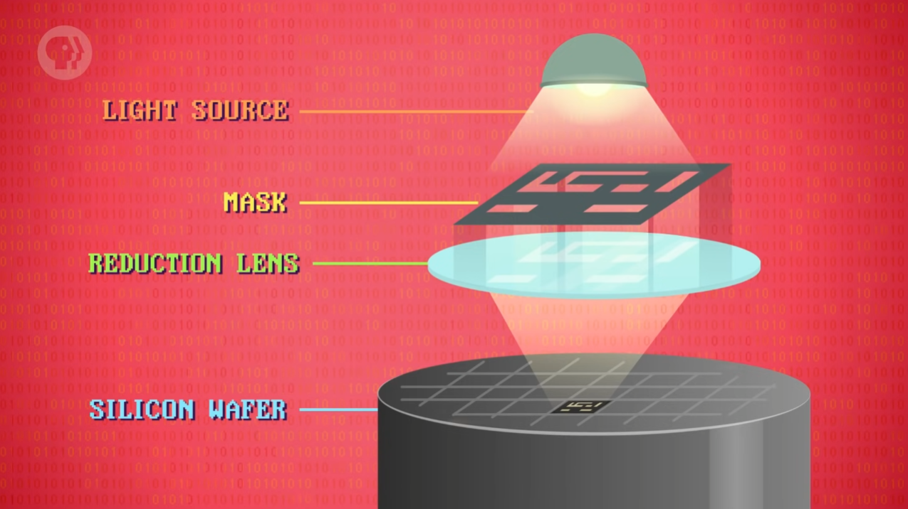

### 1.10.1 集成电路（Integrated Circuits）

#### 数字暴政

1940s~1960s 中期，计算机由独立部件用线连接而成组成，这些独立部件称为「分立元件」（discrete components）。

若想提升性能，只能增加更多分立元件，这会导致更多更复杂的电线，这种问题称为「数字暴政」（Tyranny of Numbers）。

比如 1.2.3 小节提及的 ENIAC 就使用了 1.7w 多个真空管，7w 个电阻，1w 个电容，500w 个手工焊点。

后来到了  1950s 中期，更小更可靠的晶体管在市场上出现。1959 年 IBM 将 709 计算机中的电子管换为晶体管制造出了 IBM 7090，其速度提升 6 倍，价格只有一半。但商业化的晶体管仍然属于分立元件。

数字暴政问题的严重性在 1960s 达到顶峰，亟待引入新抽象来封装这种复杂性。

#### 集成电路

1958 年，Jack Kilby 使用锗作为材料将独立部件用电线连接集成在一起，使得原先分立元件组合成了新的独立组件单元，集成电路（Integrated Circuits, IC）自此出现。

1959 年，Robert Noyce 所在公司仙童半导体使用了更稳定储量也更多的硅作为集成电路材料，使得集成电路被广泛使用。Noyce  也因此被公认为现代集成电路之父，开创了电子时代（the electronics era）。

#### 印刷电路板

起初的 IC 只集成了几个晶体管，可以将 1.3 节的逻辑门封装成单独组件，但 IC 之间的相互连接仍然不便。于是出现了「印刷电路板」（Printed Circuit Boards, PCB）。

印刷电路板通过蚀刻（etch）金属线的方式将零件连接在一起，无需焊接或是使用一大堆线，并且可以大规模量产。

PCB 和 IC 相结合使得分立元件和电线大幅减少，实现相同功能。

### 1.10.2 光刻技术（Photolithography）

受限于当时的技术，在 IC 立塞 5 个以上的分立元件还是很困难，直到新的制作工艺「光刻」（Photolithography）出现，其利用光将图案印到材料上，可以使用基础操作来制造复杂电路。以用光刻技术制作晶体管为例：

#### 蚀刻（etch）

- 晶圆（silicon wafer）：最基础的硅薄片，一种半导体材料，有时导电有时不导电。
- 氧化层（oxide layer）：保护层。
- 光刻胶（photoresist）：光照后可溶，可以使用特殊化学药剂洗掉。
- 光掩膜（photomask）：用于遮挡不希望被强光照射融化的地方。

强光照射后，未被光掩模遮挡的光刻胶部分会发生化学变化，使用一种化学物质洗去后，氧化层露出：

用另一种化学物质（通常是酸）洗去氧化层中间露出部分，注意两侧氧化层被光刻胶保护未被洗去：

使用另一种化学药品洗掉光刻胶，蚀刻完成：

#### 掺杂（doping）

使用高温气体（比如磷）渗透进暴露出的硅，改变硅的电学性质，使得其导电性更好，这一化学过程称为掺杂（doping）。

（注：半导体的具体物理和化学性质可参见 [Youtuber Derek Muller 的频道 @Veritasium](https://www.youtube.com/watch?v=IcrBqCFLHIY&t=0s)。）

再重复一次蚀刻，放上光刻胶和光掩模，开出新形状的缺口：

用另一种气体对硅进行掺杂，控制好深度和时机，控制其不超过之前的区域：

#### 金属化（metalization）

材料处理完后，需要在氧化层上制作出通道，用于放置细小金属导线来连接晶体管。依旧使用光刻胶和光掩膜重复蚀刻步骤，刻出通道。

接着放置一层薄金属（铝或者铜），该过程称为金属化（metalization）：

再通过光刻胶和光掩膜重复蚀刻步骤，将金属上的具体电路蚀刻出：

至此一个晶体管（transistor）制作完工。这是一个双极型晶体管（bipolar junction transistor），由三根线连接不同的区域，每个趋于的掺杂方式不同。

#### 微型芯片（chip）

光刻法同样可以制作电阻或电容等其他电子元件和相互连接的电路，其均可制作在一片硅上。

光刻法一次会制作上百万个细节，同时通过焦距改变可以将透过光掩膜的光投射成任意大小，以便于制作出精细细节。

IC 中会有许多导线上下交错，连接各个元件。一片晶圆可以制作很多 IC ，整块晶圆制作完成会后切割然后包裹进微型芯片（chip）中，成为它的核心。

### 1.10.3 罗尔定律（Moore' Law）

因光刻技术的发展，晶体管变小且集成密度变高。从 1960s 初 IC 塞不下超过 5 个晶体管，到 1960s 中期市场出现超过 100 个晶体管的 IC，于是 1965 年戈登摩尔（Gordon Moore）看到了某些趋势：

每两年左右，得益于材料和制造技术的发展，同样大小的空间可以塞进两倍数量的晶体管。

这被称作是罗尔定理，虽然名为“定律”，但其实只是一种正确趋势。

与此同时，芯片的价格也在急剧下降，从 1962 年的平均 50 美元，到 1968 年的 2 美元左右，再到现在几分钱的 IC ，晶体管更小密度更高价格也低廉。

### 1.10.4 Intel 4004

晶体管越小，所要移动的电荷量就越少，就能越快速滴切换状态，耗电更少。同时，电路更紧凑也意味着信号延迟更低，时钟速度也会更快。

1968 年，罗伯特·诺伊斯（Robert Noyce）和戈登·摩尔联手成立了新公司 Intel——现今最大的芯片制造商，该名字源于 Integrated（集成）和 Electronics（电子）两个词的组合。

发布于 1971 年的 Intel 4004 CPU 是重要的里程碑，其是第一个使用 IC 制作的微型处理器（microprocessor），集成了 2.3k 个晶体管。

### 1.10.5 超大规模集成（VLSI）

自 Intel 4004 始，CPU 中集成的晶体管数量爆发式增长：

- 1980 年，3w 晶体管
- 1990 年，100w 晶体管
- 2000 年，3000w 晶体管
- 2010 年，10 亿晶体管

实现 10 亿这种密度的光刻技术分辨率约为 1w 纳米，是人类头发直径的 1/10。现如今已发展到 14 纳米，比红细胞小 400 倍。

与此同时，大多数电子器件——RAM、显卡、固态硬盘、摄像头感光元件 etc. ——也在指数式发展。

以 iPhone 7 的 A10 CPU 为例，其在 1cm ×1 cm 大小的面积中集成了 33 亿个晶体管。

这样数量级的电路设计显然无法人力一个个完成，自 1970 年代开始，现代工程师就开始使用「超大规模集成」（very-large-scale integration, VLSI）来自动生成芯片设计。

比如使用「逻辑综合」（logic synthesis）这种技术，可以放置像缓存内存（memory cache）一样的完整高级组件，软件会自动高效生成电路。

### 1.10.6 世代演变与瓶颈

- 计算 1.0（the 1st generation of computer）：真空管
- 计算 2.0（the second generation of electronic computing）：晶体管
- 计算 3.0（the third generation of computing）：IC 出现并用于制作微处理器
- 计算 4.0 （the fourth generation computer）：超大规模集成电路

摩尔定律也许接近终结了，如果进一步做小芯片，会面临两个主要问题：

1. 波长精度极限：光刻法中使用的光的波长精度已经到达极限，无法更精细地使用光掩膜来蚀刻图案。因此，科学家在研制波长更短的光源，用以投射更小的图案。
2. 量子隧道贯穿（quantum tunneling）：当晶体管非常小，电极之间可能只举例几个原子，电子会跳过间隙，这种现象称为量子隧道贯穿。这会使得晶体管漏电，无法成为好的开关器件。实验室中已经造出 1 纳米大小的晶体管，但能否量产未知。
